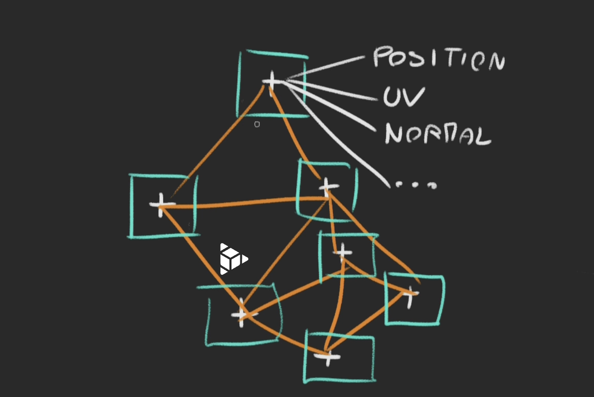
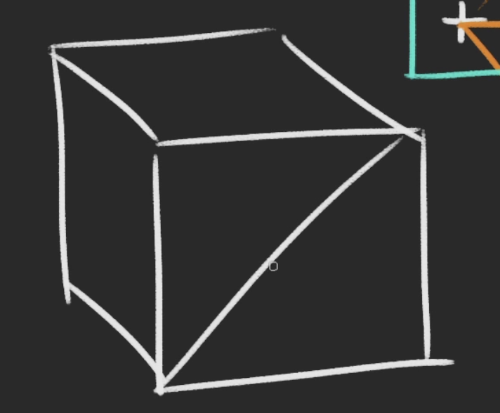
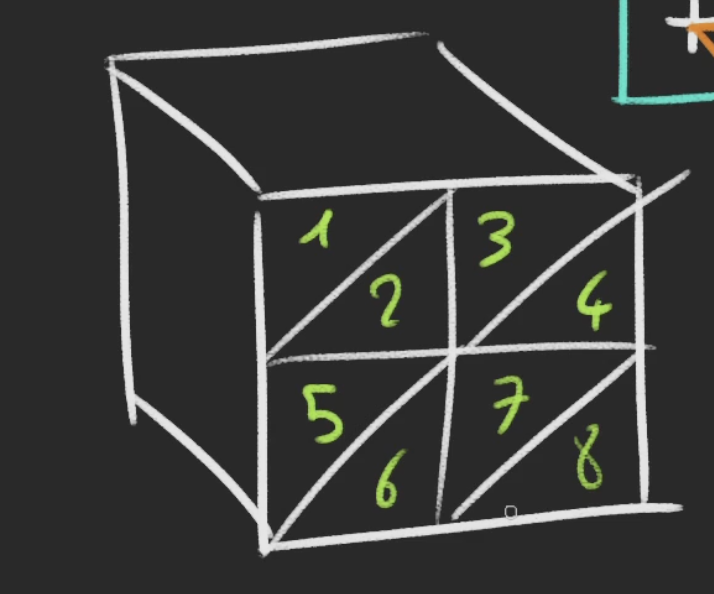

How to work with reminder.md:

Preview Notes: hit "Cmd/k" let go of the keys and press the letter "v"

Add Image: "drag/shift" drag and hold the shit key that allows us to specify where we want the photo within the notes.

---

## Geometries: 
Geometries are composed of vertices (point coordinates in 3D spaces) and Faces (triangles that join those vertices to create a surface).

### Vertex:
is a singular of vertices and its is point in 3D space that defines the geometry of a shape. It is typically represented as a vector with three coordinates: x, y, and z.

### Vertices:
Plural of Vertex

#### Key Attributes:
'position': Defines vertex positions.

'normal': Defines normals for lighting calculations.

'uv': Defines texture coordinates for mapping textures.

## BoxGeometry Parameters:
1- width: The size on the x axis

2- height: The size on the y axis

3- depth: The size on the z axis

4- widthSegments: How many 
subdivisions in the x axis

5- heightSegments: How many 
subdivisions in the y axis

6- depthSegments: How many 
subdivisions in the z axis

### Subdevisions:
Subdevision 1 = 2 triangles per face.

Subdevision 2 = 8 triangles per face.

